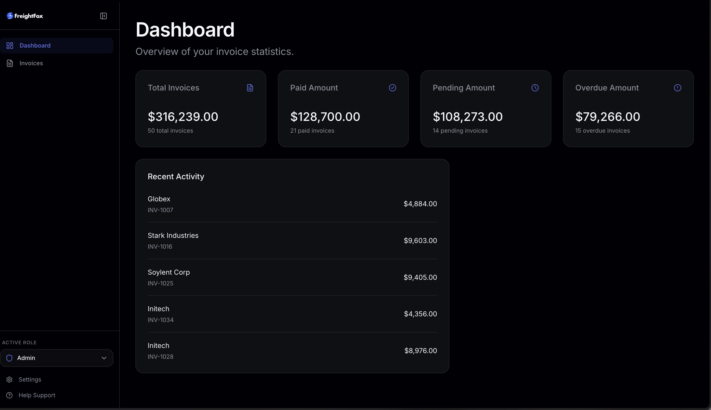
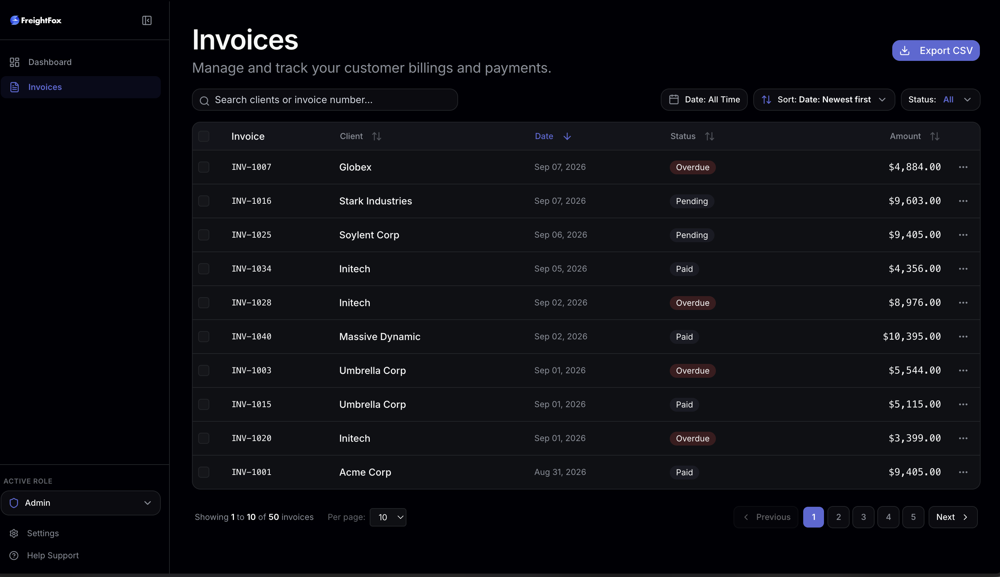
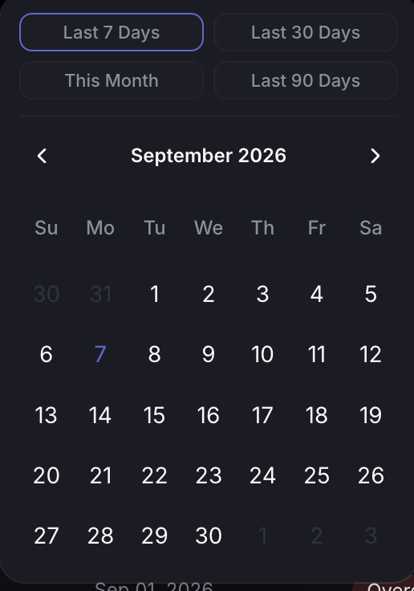
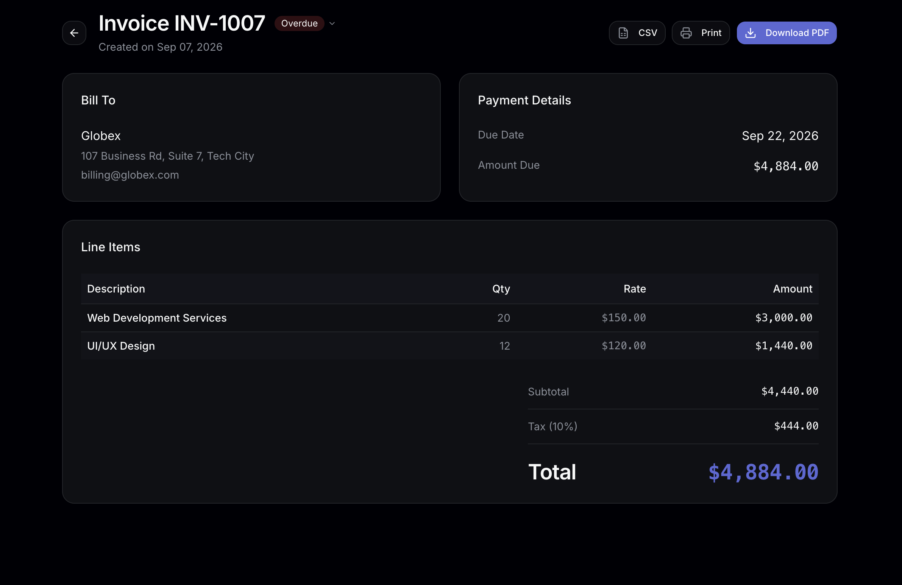
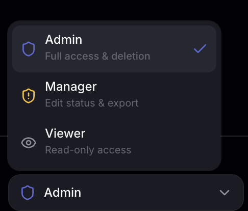

# 🦊 FreightFox — Invoice Management System

A high-performance, Linear-inspired dark mode Invoice Management System built with **React 19**, **TypeScript**, and **Tailwind CSS**. Designed with sub-millisecond interaction speed, rich micro-interactions, full keyboard/mouse responsiveness, and strict architectural decoupling.

---

## 📸 Screenshots

| Feature | Preview |
| :--- | :--- |
| **Dashboard** |  |
| **Invoice Listing** |  |
| **Date Range & Filters** |  |
| **Invoice Details & Print** |  |
| **Role-Based Switcher** |  |

---

## ✨ Features Overview

### 1. 📊 Executive Financial Dashboard
- **Metric Cards:** High-level monetary and count summaries for **Total Invoices**, **Paid Amount**, **Pending Amount**, and **Overdue Amount**.
- **Recent Activity Feed:** Quick look at the 5 most recent client billings and invoice statuses.
- **Unified Linear Aesthetic:** Streamlined dark canvas (`#010102`), subtle hairlines, and primary indigo accent (`#5e6ad2`).

<!-- Screenshot placeholder: Dashboard -->
> 

---

### 2. 🧾 Invoice Listing & Row Navigation
- **Table View:** Clean, dense table displaying invoice numbers, client names, issue dates, status badges, amounts, and row actions.
- **Full Row Clickability:** Click anywhere on an invoice row to instantly navigate to its details view.
- **Non-blocking Interactive Targets:** Checkboxes, quick action menus, and links stop event propagation to avoid accidental navigation.

<!-- Screenshot placeholder: Invoice List -->
> 

---

### 3. 🔍 Search, Date Range & Sorting
- **Real-Time Search:** Instant client name and invoice number querying.
- **Date Range Picker (`react-day-picker`):** 
  - **Quick Presets:** 1-click filtering for *Last 7 Days*, *Last 30 Days*, *This Month*, and *Last 90 Days*.
  - **Custom Range:** Interactive calendar popover allowing custom start and end date selection.
- **Status Filter:** Filter by *All*, *Paid*, *Pending*, or *Overdue*.
- **Dedicated Sorting Dropdown:** Quick-sort by *Date (Newest/Oldest)*, *Amount (High to Low / Low to High)*, *Client (A → Z / Z → A)*, and *Due Date*. Synchronized with column header sort arrows.

<!-- Screenshot placeholder: Filters & Sorting -->
> 

---

### 4. 📄 Pagination & Density
- **Pagination Controls:** Ellipsis-aware page numbering (`1, 2, 3... Next`) styled with active indigo pill indicators.
- **Records Per Page:** Easily switch between `10`, `20`, or `50` rows per page with automatic page-1 boundary reset.

---

### 5. 📦 Bulk Selection & Batch Actions
- **Page-Scoped Select All:** Check the table header checkbox to toggle selection of all rows on the active page.
- **Context-Aware Action Buttons:**
  - **Export Selected (N):** Automatically adapts the export button to download only selected invoices if checkboxes are active.
  - **Batch Delete (Admin Only):** Confirmation-gated mass deletion of all selected invoices.

<!-- Screenshot placeholder: Bulk Selection -->
> 

---

### 6. 💾 CSV & PDF Export / Print Engine
- **Bulk CSV Export:** Exports all filtered or selected invoices with properly escaped fields, date formatting, and timestamped filenames (`invoices_YYYY-MM-DD_HHmm.csv`).
- **Single Invoice CSV:** Quick 1-click CSV download for individual invoices directly from row action menus.
- **Branded PDF / Print Document:** Dedicated print generation utility in [`src/utils/invoicePdf.ts`](./src/utils/invoicePdf.ts) that renders a formatted invoice with company branding, client addresses, line items, taxes, and totals for standard paper printing or Save-as-PDF.

<!-- Screenshot placeholder: Invoice Details -->
> 

---

### 7. 🛡️ Role-Based Access Control (RBAC)
Includes a global role management system with an interactive **Role Switcher** in the sidebar:

| Role | Permissions & Gated Actions |
| :--- | :--- |
| **🛡️ Admin** | **Full Access:** View invoices, update invoice statuses (*Paid/Pending/Overdue*), perform single and bulk deletions, export CSV/PDF. |
| **⚠️ Manager** | **Operational Access:** View invoices, update invoice statuses, export CSV/PDF. **Delete actions are disabled/hidden.** |
| **👁️ Viewer** | **Read-Only Auditor:** View dashboard and invoice details, export CSV/PDF. **All delete actions and status update controls are disabled.** |

<!-- Screenshot placeholder: RBAC Switcher -->
> 

---

## ⚡ Performance & Architecture Highlights

- **Instant Zero-Latency Transitions:** In-memory mock service runs with 0ms artificial delay for instantaneous tab navigation.
- **Decoupled Architecture:** Decomposed from a 580+ line monolithic file into dedicated presentational components (`InvoiceToolbar`, `InvoiceTable`, `InvoiceTableRow`, `InvoicePagination`, `DateRangeFilter`).
- **Row Memoization (`React.memo`):** Table rows are individually memoized with `useCallback` stable handlers; toggling a checkbox on 1 row bails out re-rendering on the remaining 49 rows.
- **Pure Business Logic:** Pure CSV and PDF utilities isolated in `src/utils/` without React or DOM dependencies.
- **Thinking Orb Loader:** Smooth orbital state animations via `thinking-orbs` during initial data load.

---

## 🛠️ Tech Stack

- **Framework:** React 19 + Vite
- **Language:** TypeScript
- **Styling:** Tailwind CSS + Vanilla CSS Tokens
- **Icons:** Lucide React
- **Date Utilities:** `date-fns` + `react-day-picker`
- **Animations / Loaders:** `thinking-orbs`

---

## 🚀 Getting Started

### 1. Clone & Install
```bash
git clone https://github.com/mayank543/Invoice-dashboard.git
cd Invoice-dashboard
npm install
```

### 2. Run Development Server
```bash
npm run dev
```
Open [http://localhost:5173](http://localhost:5173) in your browser.

### 3. Build for Production
```bash
npm run build
```
Generates optimized static assets in the `dist/` folder.
